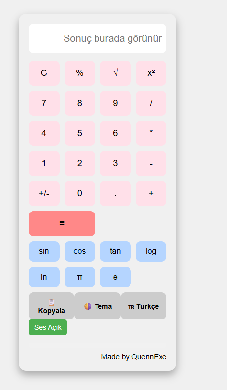
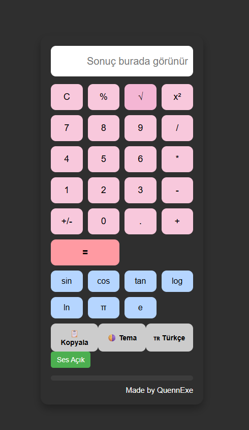

# Simple-Calculator# 🧮 Basit Hesap Makinesi / Simple Calculator

Bu proje, toplama, çıkarma, çarpma ve bölme işlemlerini yapabilen basit bir hesap makinesi uygulamasıdır. Web tabanlı arayüzü sayesinde temel aritmetik işlemleri kolayca gerçekleştirmenizi sağlar.

---

## 🎯 Projenin Amacı

- Temel matematiksel işlemleri gerçekleştiren kullanıcı dostu bir arayüz oluşturmak.
- JavaScript ile input verilerini işlemek, hesaplamak ve sonucu ekranda göstermek.
- Olay (event) yönetimi ve veri akışı mantığını öğrenmek.

---

## 🚀 Özellikler

- Toplama, çıkarma, çarpma, bölme işlemleri
- Temizle (clear) butonu
- Gerçek zamanlı sonuç hesaplama
- Tuşlarla etkileşimli kullanım
- Hata durumları için önlem (örneğin, sıfıra bölme kontrolü)

---

## 🛠️ Kullanılan Teknolojiler

- **HTML5:** Hesap makinesi arayüzü (butonlar, ekran)
- **CSS3:** Buton tasarımı, düzen ve görünüm
- **JavaScript (ES6):** Hesaplama mantığı, event handling

---

---

## 🧠 Nasıl Çalışır?

1. Kullanıcı butonlara tıklayarak sayıları ve işlemleri girer.
2. JavaScript, girilen ifadeyi parse ederek sonucu hesaplar.
3. `=` butonuna tıklandığında sonuç ekranda gösterilir.
4. C (clear) butonuyla ekran sıfırlanabilir.

---

## 👥 Ekip / Kaynaklar

- Geliştirici: [Quenn Exe ]
- Kaynaklar:
  - [MDN JavaScript Math](https://developer.mozilla.org/en-US/docs/Web/JavaScript/Reference/Global_Objects/Math)
  - [CSS Grid Layout Guide](https://css-tricks.com/snippets/css/complete-guide-grid/)

---

## 💡 Geliştirme Önerileri

- Klavye desteği eklenebilir (tuşla da kullanılabilir).
- Gelişmiş matematiksel fonksiyonlar (√, %, π vb.) eklenebilir.
- Mobil cihazlara uyum için responsive tasarım yapılabilir.
- Girdi geçmişi (history) özelliği entegre edilebilir.

# 🖼️ Arayüz Görünümü
|  |  |