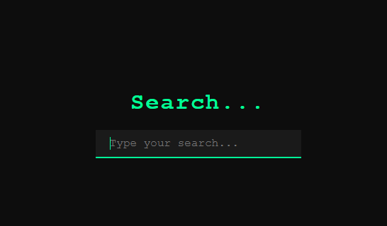

# Simple-Calculator# 🕵️‍♂️ Arama Kutusu Şifre Çözme Efekti / Decryption of the Search Box

Bu proje, sayfa yüklendiğinde arama kutusunun üzerinde yer alan başlığın harf harf "şifresi çözülüyormuş" gibi görünmesini sağlar. Siber güvenlik, hacker temalı arayüzler veya dikkat çekici etkileşimli UI deneyimleri tasarlamak için idealdir.

---

## 🎯 Projenin Amacı

- Kullanıcının dikkatini metin üzerine çekmek.
- Basit bir başlık metnine etkileşim ve animasyon ekleyerek UI'ı zenginleştirmek.
- Şifre çözme (decryption) temalı bir animasyon mantığını öğrenmek.

---

## 🚀 Özellikler

- Sayfa yüklenince harfler rastgele karakterlerle başlar ve hedef metne dönüşür.
- Gerçek zamanlı olarak metin karakterleri birer birer açılır.
- Arama kutusuyla entegre edilmiştir, kullanıcı deneyimini güçlendirir.

---

## 🛠️ Kullanılan Teknolojiler

- **HTML5:** Yapı ve form elemanları
- **CSS3:** Tema, yazı tipi ve renk ayarları
- **JavaScript (ES6):** Decryption animasyon mantığı

---

---

## 🧠 Nasıl Çalışır?

1. `h1` etiketi içindeki metin şifreli bir dizi (örneğin `████████`) olarak başlar.
2. JavaScript bu metni, rastgele karakterler üzerinden geçerek gerçek metne (örn. "Search...") dönüştürür.
3. Her birkaç milisaniyede bir, doğru karakterler yerlerine oturur ve görsel olarak çözülme efekti oluşur.

---

## 👥 Ekip / Kaynaklar

- Geliştirici: [Quenn Exe]
- Kaynaklar:
  - [CSS-Tricks: Animated Text Reveal](https://css-tricks.com/)
  - [JavaScript Math.random()](https://developer.mozilla.org/en-US/docs/Web/JavaScript/Reference/Global_Objects/Math/random)

---

## 💡 Geliştirme Önerileri

- Farklı metinler veya input kutularında da bu animasyon kullanılabilir.
- Daha gelişmiş kriptografi animasyonları (binary, matrix tarzı) eklenebilir.
- Kullanıcının input yazmasına bağlı olarak harf çözülmeleri yapılabilir.

# 🖼️ Arayüz Görünümü

|  |

