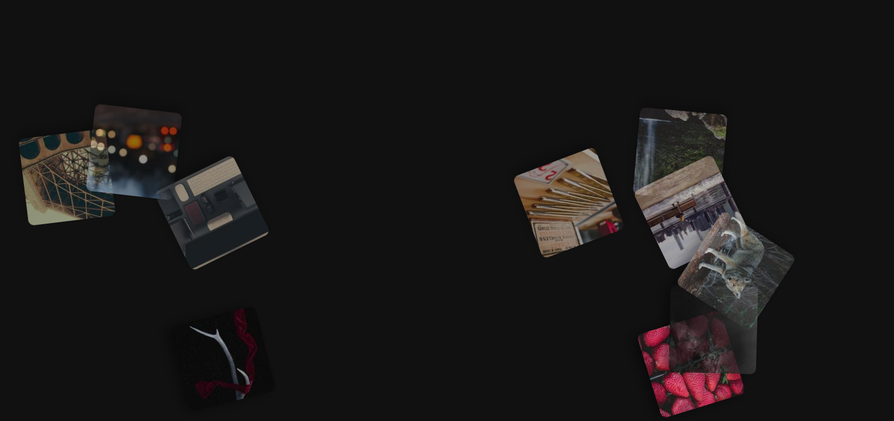

# 🌌 Automatic Floating Image Gallery

Bu proje, HTML, CSS ve JavaScript kullanılarak oluşturulmuş dinamik bir "Automatic Floating Image Gallery" uygulamasıdır. Görseller rastgele konumlandırılır ve yumuşak geçişlerle yukarı doğru süzülerek bir görsel şölen sunar. Basit ama etkileyici bir ön yüz animasyon projesidir.

## 🖼️ Projenin Amacı

Kullanıcıya görsel içeriklerin sade ve etkileyici biçimde sunulmasını sağlamak.
Frontend animasyon tekniklerini öğrenmek ve uygulamak.
Rastgelelik, animasyon ve DOM manipülasyonu konularını pekiştirmek.

## 🚀 Özellikler

- Görsellerin ekran boyunca yumuşak ve döne döne süzülmesi
- Rastgele X konumlandırması, animasyon süresi ve gecikmesi
- Modern CSS animasyonları ve JavaScript ile etkileşim
- Responsive uyumlu yapıya kolayca adapte edilebilir

## 🛠️ Kullanılan Teknolojiler

- HTML5
- CSS3 (Keyframes, Animasyonlar, Box-Shadow)
- JavaScript (DOM Manipülasyonu, Rastgelelik)

## 🧠 Nasıl Çalışır?

1. HTML'de görseller sabit bir container içine yerleştirilir.
2. CSS ile `@keyframes` kullanılarak yukarı süzülme animasyonu tanımlanır.
3. JavaScript her görsel için:
   - rastgele bir `left` konumu,
   - rastgele bir animasyon süresi ve gecikmesi atar.
4. Böylece her görsel kendi yolunda farklı zamanlamalarla süzülerek sürekli döner.

## 📸 Örnek Görseller

> Görseller `https://picsum.photos` üzerinden rastgele olarak çekilir. Dilerseniz kendi görsellerinizle değiştirebilirsiniz.

## 👥 Ekip / Kaynaklar

- Tasarım ve Kodlama: [Quenn Exe]
- Görseller: [https://picsum.photos](https://picsum.photos)
- İlham: Drift efekti ve doğa manzaralı animasyonlardan

## 🔮 Geliştirme Fikirleri

- Hover animasyonları eklenebilir.
- Mobil uyumlu hale getirilebilir.
- Görseller tıklanabilir yapılarak lightbox gibi detay gösterimi eklenebilir.
- Farklı hareket yolları (`bezier curve`, `zigzag`, vs) tanımlanabilir.

# 🖼️ Arayüz Görünümü

|  |

