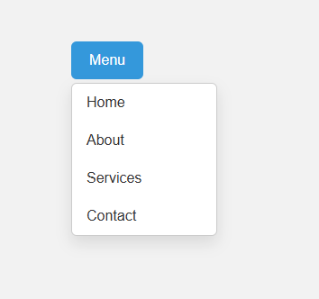

# 🔽 Clickable Drop-down Menu

Bu proje, HTML, CSS ve JavaScript kullanılarak oluşturulmuş basit ama işlevsel bir "Clickable Drop-down Menu" uygulamasıdır. Kullanıcı butona tıkladığında menü görünür olur; kullanıcı başka bir yere tıklarsa menü otomatik kapanır.

## 🎯 Projenin Amacı

- Kullanıcı dostu bir navigasyon menüsü oluşturmak
- Tıklama ile açılıp kapanan etkileşimli bir yapı kurmak
- JavaScript ile DOM olaylarını kontrol etmek

## 🚀 Özellikler

- Tıklanabilir açılır menü (dropdown)
- Responsive ve sade tasarım
- Dışarı tıklanınca otomatik kapanma
- CSS ile geçişli stiller

## 🛠️ Kullanılan Teknolojiler

- HTML5
- CSS3 (Hover efektleri, gölgeler)
- JavaScript (Event listener, DOM manipülasyonu)

## 🧠 Nasıl Çalışır?

1. HTML'de bir düğme ve ona bağlı bir menü listesi vardır.
2. CSS ile menü gizlenmiş ve şık biçimde stillenmiştir.
3. JavaScript ile:
   - Düğmeye tıklanınca menü açılır/kapanır.
   - Sayfanın başka bir yerine tıklanırsa menü kapanır.

## 👥 Ekip / Kaynaklar

- Geliştirici: [Quenn Exe]
- İlham: Modern UI/UX pratikleri

## 🌱 Geliştirme Önerileri

- Menü animasyonu eklenebilir (fade veya slide)
- Menü mobil uyumlu hale getirilebilir (hamburger menü)
- Menüye alt başlıklar veya ikonlar eklenebilir
- Toggle butonuna açık/kapalı simgeleri eklenebilir

# 🖼️ Arayüz Görünümü

|  |

