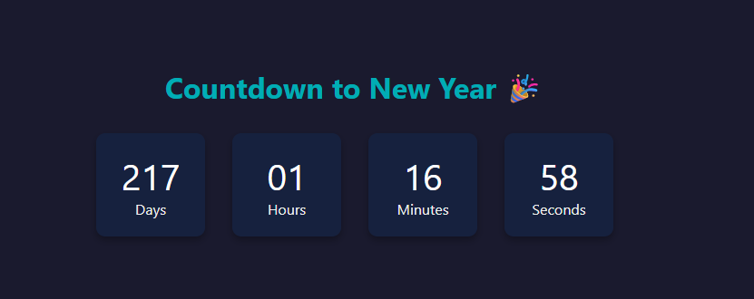

# ⏳ Countdown Timer

Bu proje, HTML, CSS ve JavaScript ile hazırlanmış bir **geri sayım sayacı**dır. Belirlenen hedef tarihe kadar kalan zamanı gün, saat, dakika ve saniye cinsinden gösterir.

## 🎯 Projenin Amacı

- Zaman hesaplama mantığını öğrenmek
- Dinamik olarak DOM manipülasyonu uygulamak
- Gerçek zamanlı UI güncellemeleri gerçekleştirmek

## 🚀 Özellikler

- Gerçek zamanlı güncelleme
- Zaman dolduğunda özel mesaj gösterimi
- Şık ve modern tasarım

## 🛠️ Kullanılan Teknolojiler

- HTML5
- CSS3 (Responsive tasarım, kutu gölgelendirme)
- JavaScript (Date objesi, zamanlayıcı)

## 🧠 Nasıl Çalışır?

1. JavaScript `Date` objesi ile şimdiki zamanı ve hedef zamanı hesaplar.
2. Aradaki fark her saniye yeniden hesaplanarak ekranda gösterilir.
3. Süre dolduğunda animasyonlu bir mesaj çıkabilir veya kutlama yapılabilir.

## 👥 Ekip / Kaynaklar

- Geliştirici: [Quenn Exe ]
- İlham: Yeni yıl sayaçları, kampanya geri sayımları

## 💡 Geliştirme Fikirleri

- Sesli alarm ya da görsel animasyon eklenebilir
- Tarih kullanıcıdan alınabilir
- Mobil için optimize edilebilir
- Temalar (karanlık/açık) eklenebilir

# 🖼️ Arayüz Görünümü

|  |