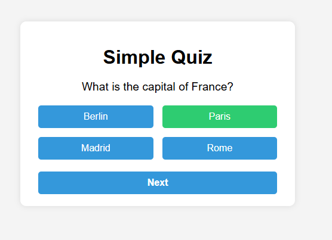

# 📝 Simple Quiz Application

Bu proje, temel JavaScript ile interaktif bir quiz uygulamasıdır. Kullanıcı soruları yanıtlar, doğru/yanlış geri bildirim alır ve sonunda puanını görür.

## 🎯 Projenin Amacı

- JavaScript event handling ve DOM manipülasyonu pratik etmek
- Basit UI ve kullanıcı etkileşimi oluşturmak
- Program akışı kontrolü sağlamak

## 🚀 Özellikler

- Sorular ve cevaplar dinamik olarak yüklenir
- Doğru/yanlış seçimi renklerle gösterilir
- Sıradaki soruya geçme imkanı
- Sonuç sayfası ile puan gösterimi
- Yeniden başlatma butonu

## 🛠️ Kullanılan Teknolojiler

- HTML5
- CSS3
- JavaScript (ES6+)

## 🧠 Nasıl Çalışır?

1. Quiz soruları JS dizisi içinde tanımlıdır.
2. Her soru ekranda gösterilir, cevaplar buton olarak oluşturulur.
3. Kullanıcı bir cevaba tıkladığında doğru/yanlış işaretlenir ve butonlar pasif hale gelir.
4. “Next” ile sonraki soruya geçilir.
5. Son sorudan sonra sonuç gösterilir.

## 👥 Ekip / Kaynaklar

- Geliştirici: [Quenn Exe ]
- İlham: Eğitim ve öğrenme uygulamaları

## 🌟 Geliştirme Önerileri

- Soruları dış JSON dosyasından yüklemek
- Zamanlı quiz eklemek
- Daha fazla soru tipi (çoklu seçim, boşluk doldurma)
- Puan kaydetme ve ilerleme takibi

:frame_photo: Arayüz Görünümü

|  |