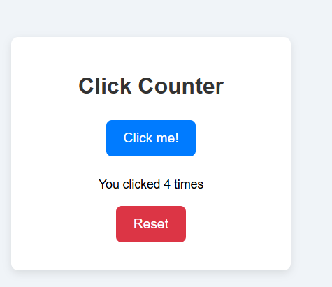

# 👆 Click Counter

Bu basit proje, kullanıcıların butona tıklama sayısını sayan bir sayıcıdır. JavaScript ile temel DOM manipülasyonu ve event handling öğrenmek için birebirdir.

## 🎯 Projenin Amacı

- Event listener kullanımını anlamak
- DOM elementlerini dinamik olarak güncellemek
- Kullanıcı etkileşimlerine hızlı yanıt vermek

## 🚀 Özellikler

- Tıklama sayısını anlık gösterme
- Sıfırlama butonu ile sayacı resetleme
- Basit, temiz ve kullanışlı tasarım

## 🛠️ Teknolojiler

- HTML5
- CSS3
- JavaScript (ES6)

## 🧠 Nasıl Çalışır?

1. Kullanıcı “Click me!” butonuna her bastığında `count` değişkeni 1 artar.
2. Bu değer ekranda güncellenir.
3. “Reset” butonuna basıldığında sayaç sıfırlanır ve ekran güncellenir.

## 👥 Ekip / Kaynaklar

- Geliştirici: [Quenn Exe]

## 💡 Geliştirme Önerileri

- Tıklama sayısını localStorage’da saklama
- Butona basma hızını ölçme
- Animasyonlu buton efektleri

# 🖼️ Arayüz Görünümü

|  |