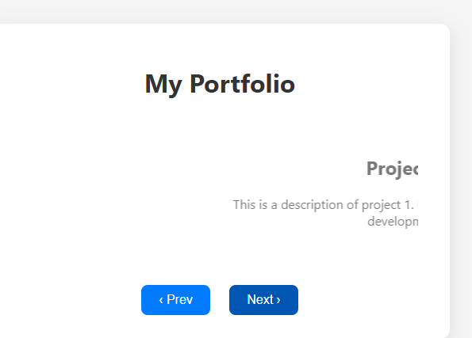

# 🖼️ Portfolio Page with Slide Transition

Bu proje, modern ve temiz bir portföy sayfası olup, projeler arasında kaydırma (slide) geçiş animasyonu içerir. Kullanıcı dostu arayüzü ve hoş animasyonları ile dikkat çeker.

## 🎯 Projenin Amacı

- CSS ve JS ile güzel slide animasyonları oluşturmak
- Etkileyici ve akıcı kullanıcı deneyimi sağlamak
- Responsive ve sade tasarım yapmak

## 🚀 Özellikler

- Projeler arası ileri/geri butonları ile geçiş
- Yumuşak slide animasyonları
- Basit ve anlaşılır kod yapısı
- Kullanıcı dostu ve modern görünüm

## 🛠️ Teknolojiler

- HTML5
- CSS3 (Flexbox, transition)
- JavaScript (ES6)

## 🧠 Nasıl Çalışır?

1. Her proje bir `slide` olarak tanımlanır ve sadece aktif slide görünür.
2. “Next” ve “Prev” butonları ile slide indeksleri değiştirilir.
3. CSS geçişleri sayesinde slide değişimleri animasyonlu gerçekleşir.

## 👥 Ekip / Kaynaklar

- Geliştirici: [Quenn Exe]
- Tasarım ilhamı: Modern web portföyleri

## 💡 Geliştirme Önerileri

- Otomatik slide geçişi eklemek
- Mobil uyumluluk ve responsive tasarım geliştirmek
- Slide içeriğine resim, video ve bağlantılar eklemek
- İleri düzey animasyonlar ile zenginleştirmek

# 🖼️ Arayüz Görünümü

|  |