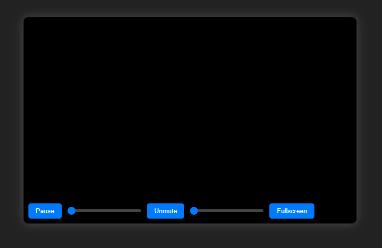

# 🎥 Custom HTML5 Video Player

Bu proje, HTML5 video öğesini temel alarak, modern ve kullanıcı dostu bir video oynatıcı oluşturur. Gelişmiş kontrollerle kullanıcı deneyimini üst seviyeye taşır.

## 🎯 Projenin Amacı

- Video oynatma/durdurma işlemleri
- Zaman çizgisi (seek bar) ile kontrol
- Ses açma/kapatma ve ses seviyesi ayarı
- Tam ekran modu

## 🚀 Özellikler

- Play/Pause butonu
- Zaman çizgisi ile ileri/geri sarma
- Sessiz/Unmute kontrolü
- Ses seviyesi kaydırıcısı
- Tam ekran açma/kapatma

## 🛠️ Teknolojiler

- HTML5 video
- CSS3 (modern stil ve responsive)
- JavaScript (event handling, DOM manipulation)

## 🧠 Nasıl Çalışır?

1. Kullanıcı play butonuna basınca video oynar, pause butonuna basınca durur.
2. Zaman çizgisi video süresi boyunca güncellenir ve kullanıcı tarafından değiştirilebilir.
3. Ses kontrolü ve sessiz-mod butonu video sesini yönetir.
4. Tam ekran butonu video elementini tam ekran yapar veya çıkarır.

## 👥 Ekip / Kaynaklar

- Geliştirici: [Quenn Exe]
- Kaynaklar: MDN Web Docs, HTML5 Video API

## 💡 Geliştirme Önerileri

- Responsive video boyutlandırma
- Kendi video playlistini oluşturma
- Video alt yazı (subtitle) desteği ekleme
- Gelişmiş tasarım ve animasyonlar

# 🖼️ Arayüz Görünümü
|  |