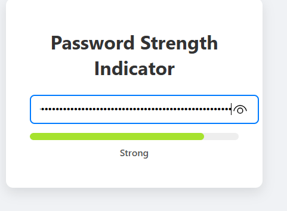

# 🔒 Password Strength Indicator

Bu proje, kullanıcıların girdikleri şifrelerin gücünü anlık olarak değerlendiren ve görsel bir geri bildirim sağlayan güçlü bir araçtır.

## 🎯 Projenin Amacı

- Şifre güvenliği farkındalığını artırmak
- Kullanıcı deneyimini geliştirmek
- JavaScript ile gerçek zamanlı veri analizi yapmak

## 🚀 Özellikler

- Şifre uzunluğu ve karmaşıklığına göre güç seviyesi belirleme
- Renk ve metin ile anlık görsel geri bildirim
- Basit ve temiz arayüz

## 🛠️ Teknolojiler

- HTML5
- CSS3
- JavaScript (ES6)

## 🧠 Nasıl Çalışır?

1. Kullanıcı şifre alanına yazdıkça JavaScript, şifreyi analiz eder.
2. Şifre uzunluğu ve içerdiği karakter çeşitliliği puanlanır.
3. Puan üzerinden renk ve metin belirlenir ve ekranda gösterilir.

## 👥 Ekip / Kaynaklar

- Geliştirici: [Quenn Exe ]
- Kaynaklar: OWASP Şifre Güvenliği Rehberleri

## 💡 Geliştirme Önerileri

- Daha karmaşık kurallar ekleyerek güvenliği artırmak
- Şifre gücü zayıfsa öneriler sunmak
- UX iyileştirmeleri ve animasyonlar eklemek

# 🖼️ Arayüz Görünümü,

|  | 