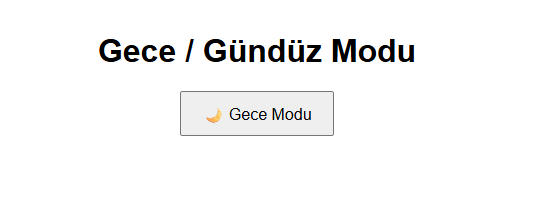
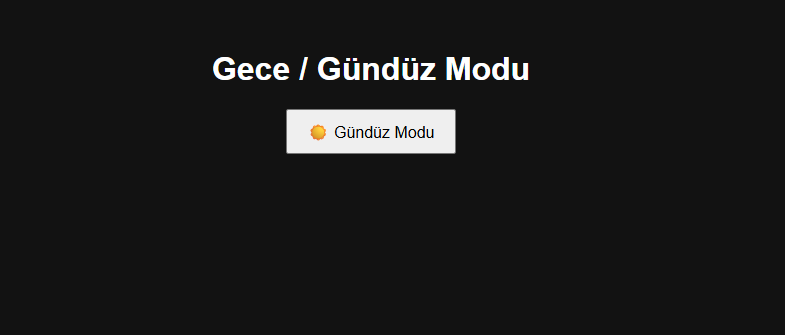

# 🌗 Gece / Gündüz Modu - Tema Değiştirici

Bu proje, kullanıcıların web sayfasında **gece (dark)** ve **gündüz (light)** temaları arasında geçiş yapmasına olanak tanır. Tema tercihi, tarayıcıya **kayıt edilir** ve sayfa yeniden yüklendiğinde otomatik olarak uygulanır.

## 🔧 Özellikler

- ☀️ Gündüz / 🌙 Gece modu arasında geçiş
- Tercih edilen tema **localStorage** ile saklanır
- Kullanıcının sistem temasına göre varsayılan tema
- Yumuşak geçişli tema değişimi (CSS transition)


## 💻 Kullanım

1. Bu dosyaları aynı klasöre yerleştir.
2. `index.html` dosyasını bir tarayıcıda aç.
3. Butona tıklayarak tema değiştir!

## 🧠 Nasıl Çalışır?

- Sayfa ilk açıldığında:
  - Eğer `localStorage`'da daha önce bir tema kaydedildiyse o tema uygulanır.
  - Aksi takdirde, sistemin varsayılan teması (örneğin bilgisayarın karanlık/gündüz modu) kullanılır.
- Kullanıcı butona bastığında:
  - Tema değiştirilir (dark ↔ light)
  - Seçilen tema `localStorage`'a kaydedilir.

  ## 👨‍💻 Kurulum ve Kullanım

1. Proje dosyalarını indirin veya klonlayın:
   ```bash
   git clone https://github.com/kullaniciadi/saat-tarih-uygulamasi.git

🖼️ Arayüz Görünümü
| Açık Tema | Karanlık Tema | 
|----------|----------------|
|  |  | 

## 👨‍💻 Geliştirici

Bu uygulama [QuennExe] tarafından geliştirilmiştir.  


