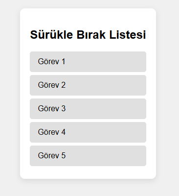

# Sürükle Bırak Liste

Bu proje, kullanıcıların görevleri veya öğeleri sürükleyip bırakarak sıralamalarını sağlayan bir listeyi temsil etmektedir. HTML, CSS ve JavaScript kullanılarak yapılmıştır.

## Özellikler

- **Sürükle ve Bırak:** Kullanıcılar, listede bulunan öğeleri sürükleyip bırakarak sıralar.
- **Basit ve Şık Tasarım:** Modern bir görünüm için CSS kullanılarak liste öğeleri özelleştirilmiştir.
- **Kullanıcı Etkileşimi:** JavaScript kullanılarak sürüklenen öğe ile etkileşim sağlanmıştır.

## Kullanılan Teknolojiler

- **HTML5:** Sayfanın yapısını oluşturmak için.
- **CSS3:** Sayfanın stilini özelleştirmek ve görsel efektler eklemek için.
- **JavaScript:** Sürükle ve bırak işlevini gerçekleştirmek için.

### `index.html`

- Sayfa yapısı ve liste öğeleri burada yer alır. Kullanıcılar, listedeki öğeleri sürükleyebilir.

### `style.css`

- Sayfa stilini belirler. Liste öğelerinin görünümü, arka plan, renkler ve etkileşimler burada tanımlanır.

### `script.js`

- Sürükle ve bırak işlevselliğini sağlayan JavaScript kodları burada bulunur. Liste öğeleri üzerinde gerçekleşen sürükleme ve bırakma işlemleri burada yönetilir.

## Kullanım

1. **HTML dosyasını açın**: `index.html` dosyasını bir tarayıcıda açarak projeyi çalıştırabilirsiniz.
2. **Sürükleyin ve bırakın**: Liste öğelerini sürükleyip yeni bir sıraya bırakabilirsiniz.

## İleriye Yönelik Geliştirmeler

- Öğeleri kaydetme işlevselliği (localStorage veya veri tabanı entegrasyonu).
- Listeye öğe ekleme ve silme gibi ek işlevler.
- Listeyi dinamik hale getirecek özellikler ekleme.

  ## 👨‍💻 Kurulum ve Kullanım

1. Proje dosyalarını indirin veya klonlayın:
   ```bash
   git clone https://github.com/kullaniciadi/saat-tarih-uygulamasi.git

🖼️ Arayüz Görünümü
| Açık Tema |
|----------|
|  | 

## 👨‍💻 Geliştirici

Bu uygulama [QuennExe] tarafından geliştirilmiştir.  

