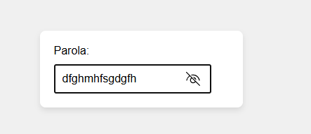

# Parola Görünür/Gizli

Bu proje, kullanıcıların parolalarını güvenli bir şekilde görüntülemelerini ve gizlemelerini sağlayan bir parola görünür/gizli gösterme özelliği sunar. Parola kutusuna girilen parolayı gizleyebilir veya görüntüleyebilirsiniz. Ayrıca, parola görünür modda iken 5 saniye sonra otomatik olarak tekrar gizlenir.

## Özellikler

- Parolayı göster/gizle butonu ile parola görünürlüğünü değiştirme.
- Parola görünürken 5 saniye sonra otomatik olarak tekrar gizlenir.
- FontAwesome simgeleri ile görsel zenginlik.

## Teknolojiler

- **HTML**: Sayfa yapısı.
- **CSS**: Sayfa stili.
- **JavaScript**: Parola görünürlüğünü değiştiren işlevsellik.


  ## 👨‍💻 Kurulum ve Kullanım

1. Proje dosyalarını indirin veya klonlayın:
   ```bash
   git clone https://github.com/kullaniciadi/saat-tarih-uygulamasi.git

🖼️ Arayüz Görünümü
| Açık Tema |
|----------|
|  | 

## 👨‍💻 Geliştirici

Bu uygulama [QuennExe] tarafından geliştirilmiştir.  
