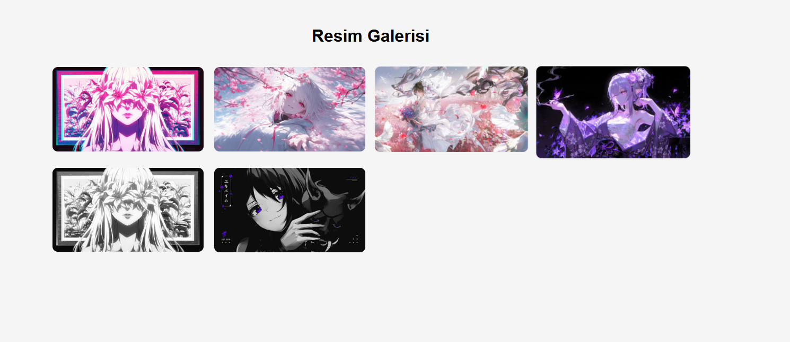

# Resim Galerisi

Bu proje, modern bir görsel galeri deneyimi sunar. Kullanıcılar küçük resimlere tıklayarak büyük boyutlu lightbox görünümünde görüntüleme yapabilir. Kullanımı basit, responsive (duyarlı) ve kullanıcı dostudur.

## Özellikler

- Galeride yer alan görseller modern bir grid düzeninde sunulur.
- Her resme tıklandığında büyütülmüş hali ekranda açılır (lightbox).
- Lightbox görüntüsü ekranın dışına tıklanarak veya kapatma butonuna basılarak kapanabilir.
- Hover animasyonu ile görsellere yakınlaştırma efekti eklenmiştir.
- Responsive yapı sayesinde mobil ve masaüstü uyumluluğu vardır.

## Kullanılan Teknolojiler

- **HTML5** – Sayfa yapısı
- **CSS3** – Görsel tasarım ve animasyonlar
- **JavaScript (Vanilla)** – Lightbox işlevselliği ve kullanıcı etkileşimi

## Nasıl Kullanılır?

1. Proje dosyalarını bilgisayarınıza indirin veya klonlayın.
2. `docs/` klasörünün içine `image1.jpg`, `image2.jpg`, ... gibi resim dosyalarınızı yerleştirin.
3. `index.html` dosyasını bir tarayıcıda açın.
4. Galerideki resimlere tıklayarak büyük boyutlu görüntüleme yapabilirsiniz.

## Örnek Görseller

Proje içinde `docs/imageX.jpg` şeklinde örnek resim yolları tanımlanmıştır. Kendi resimlerinizi bu isimlerle değiştirerek galeriye ekleyebilirsiniz.

## Geliştirme Önerileri

- Klavye ile sağ/sol oklarla gezinme eklenebilir.
- Resim açıklamaları ve numaralandırma eklenebilir.
- Slayt gösterisi (otomatik geçiş) gibi ileri düzey özellikler eklenebilir.

  ## 👨‍💻 Kurulum ve Kullanım

1. Proje dosyalarını indirin veya klonlayın:
   ```bash
   git clone https://github.com/kullaniciadi/saat-tarih-uygulamasi.git

🖼️ Arayüz Görünümü

|----------|
|  |  |

## 👨‍💻 Geliştirici

Bu uygulama [QuennExe] tarafından geliştirilmiştir.  