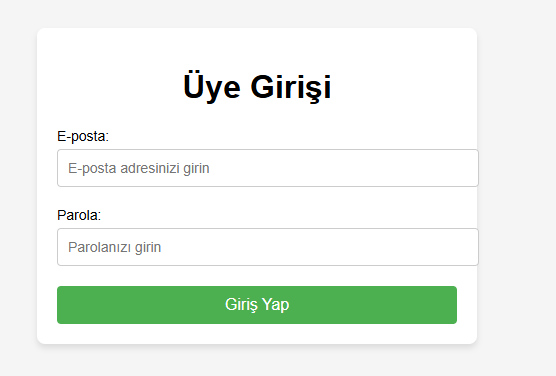

# ✅ Form Doğrulama (Email & Password) / Form Validation (Email & Password)

Bu proje, kullanıcıdan alınan e-posta ve parola girişlerini doğrulayan basit ama etkili bir form doğrulama uygulamasıdır. Amaç, form gönderiminden önce hataları engelleyerek kullanıcı deneyimini ve veri doğruluğunu artırmaktır.

---

## 🎯 Projenin Amacı

- Kullanıcının form alanlarına geçerli e-posta ve güçlü bir parola girmesini sağlamak.
- Form gönderilmeden önce hataları kontrol etmek ve kullanıcıyı uyarmak.
- Temel doğrulama mekanizmalarını öğrenmek.

---

## 🚀 Özellikler

- Geçerli e-posta formatı kontrolü (regex ile)
- Parola uzunluğu kontrolü
- Boş alan uyarısı
- Gerçek zamanlı görsel geri bildirim
- Hatalar ve başarı durumları için CSS sınıfı değişimi

---

## 🛠️ Kullanılan Teknolojiler

- **HTML5:** Form yapısı ve input alanları
- **CSS3:** Stil ve uyarı tasarımları
- **JavaScript (ES6):** Doğrulama işlemleri ve olay dinleme

---

---

## 🧠 Nasıl Çalışır?

1. Kullanıcı formu doldurmaya başlar.
2. JavaScript, e-posta adresini ve parolayı regex ve kurallar aracılığıyla kontrol eder.
3. Gerekli durumlarda kullanıcıya anlık uyarılar gösterilir.
4. Form hatasızsa gönderime izin verilir, aksi halde durdurulur.

---

## 👥 Ekip / Kaynaklar

- Geliştirici: [ Quenn Exe ]
- Kaynaklar:
  - [MDN - Form Validation](https://developer.mozilla.org/en-US/docs/Learn/Forms/Form_validation)
  - [Regex101](https://regex101.com/)

---

## 💡 Geliştirme Önerileri

- Parola gücü göstergesi entegre edilebilir.
- Daha fazla doğrulama kuralı eklenebilir (özel karakter, büyük harf vb.)
- Alanlar için farklı hata mesajları ve animasyonlar eklenebilir.
- Backend'e veri gönderimi entegrasyonu yapılabilir (fetch/post).

# 🖼️ Arayüz Görünümü
|  |