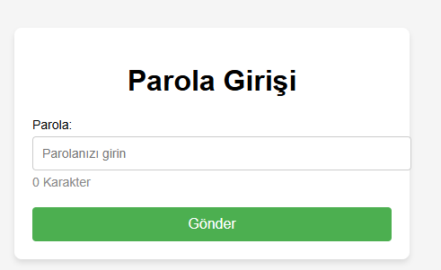

# ✍️ Karakter Sayacı / Character Counter

Bu proje, bir metin alanına girilen karakter sayısını gerçek zamanlı olarak kullanıcıya gösteren basit ve etkili bir araçtır. Özellikle sosyal medya gönderileri, form sınırları veya SEO optimizasyonu gibi durumlar için oldukça kullanışlıdır.

---

## 🎯 Projenin Amacı

- Kullanıcının belirli karakter sınırlarını aşmamasını sağlamak.
- Girilen karakterleri canlı olarak sayarak anlık geri bildirim sunmak.
- Form deneyimini daha kullanıcı dostu hale getirmek.

---

## 🚀 Özellikler

- Gerçek zamanlı karakter sayımı
- Maksimum karakter limiti tanımı
- Limit aşıldığında uyarı renkleriyle görsel geri bildirim
- Kullanıcı dostu sade arayüz

---

## 🛠️ Kullanılan Teknolojiler

- **HTML5:** `textarea`, etiket ve yapı
- **CSS3:** Görsel tasarım, renk değişimleri
- **JavaScript (ES6):** Karakter takibi ve dinamik güncelleme

---

---

## 🧠 Nasıl Çalışır?

1. Kullanıcı `textarea` alanına yazı yazmaya başlar.
2. JavaScript her tuşta karakter sayısını hesaplar.
3. Kalan karakter sayısı gösterilir (örn. 100 karakter kaldı).
4. Limit aşıldığında sayacın rengi değişerek kullanıcı uyarılır.

---

## 👥 Ekip / Kaynaklar

- Geliştirici: [Quenn Exe ]
- Kaynaklar:
  - [MDN - input events](https://developer.mozilla.org/en-US/docs/Web/API/HTMLElement/input_event)
  - [CSS Transition Tricks](https://css-tricks.com/)

---

## 💡 Geliştirme Önerileri

- Sayının yanında kelime sayımı da eklenebilir.
- Karakter sınırlı formlarla (örneğin Twitter API) entegrasyon sağlanabilir.
- İfade simgeleri veya özel karakter uyarıları eklenebilir.
- Mobil uyumluluk ve erişilebilirlik artırılabilir.

# 🖼️ Arayüz Görünümü
|  |